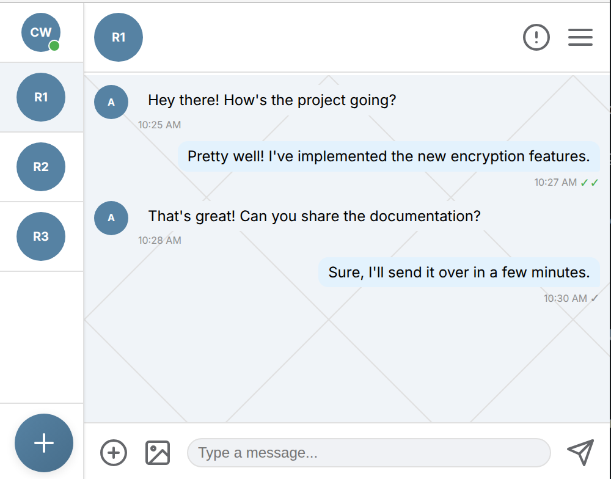

# CipherWave - Secure P2P Messenger



CipherWave is a decentralized, anonymous, peer-to-peer messenger with end-to-end encryption and cipher choice. It enables secure communication directly between browsers without central servers for messaging.

## Features

- **Anonymous Communication**: No user accounts or personal information required
- **Peer-to-Peer Secure Messaging**: Direct browser-to-browser communication using WebRTC
- **Multiple Cipher Options**: Choose between AES-256, RSA, or ChaCha20 encryption
- **Decentralized Architecture**: No central server required for messaging
- **Mobile-First Design**: Fully responsive interface that works on mobile devices
- **Node Hosting**: Users can contribute to the network by hosting their own signaling nodes
- **Enhanced Security**: Improved server security with message validation and connection health checks
- **Better Error Handling**: Comprehensive error handling and logging for easier debugging

## How It Works

CipherWave uses WebRTC for direct peer-to-peer communication between browsers. A minimal signaling server is used only for initial connection setup, after which all messaging happens directly between peers.

The application supports two modes:
1. **Host Network Node**: Run your own signaling server to help facilitate connections for other users
2. **Join Network**: Connect to an existing signaling server to communicate with others

## Installation

1. Clone or download this repository
2. Install Node.js (if not already installed)
3. Install dependencies:
   ```
   npm install
   ```

## Usage

### Option 1: Using the Built-in Signaling Server

1. Start the built-in signaling server:
   ```
   npm start
   ```
   or
   ```
   node server.js
   ```

2. Open `index.html` in two separate browser tabs/windows

3. In both tabs:
   - Click "Join Network"
   - Enter the same room ID in both tabs (or generate one in the first tab and copy to the second)
   - Select the same encryption cipher in both tabs
   - Click "Connect" in both tabs
   - Start messaging securely between the tabs

### Option 2: Hosting Your Own Signaling Node

1. Start your own signaling node:
   ```
   npm run start-node [port]
   ```
   or
   ```
   node node-host.js [port]
   ```
   (Replace [port] with your desired port number, default is 8080)

2. Open `index.html` in two separate browser tabs/windows

3. In both tabs:
   - Click "Join Network"
   - Enter the same room ID in both tabs (or generate one in the first tab and copy to the second)
   - Select the same encryption cipher in both tabs
   - Click "Connect" in both tabs
   - Start messaging securely between the tabs

### Automatic Server Discovery

The application now automatically discovers available signaling servers from a predefined list, eliminating the need to manually specify server addresses.

## Technical Details

### Encryption

CipherWave supports three encryption ciphers:
- **AES-256**: Symmetric encryption using a randomly generated key
- **RSA**: Asymmetric encryption (simulated in this implementation)
- **ChaCha20**: Stream cipher (simulated using AES in this implementation)

In a production implementation, proper key exchange mechanisms would be used for secure communication.

### WebRTC Implementation

The application uses WebRTC for peer-to-peer communication:
- STUN servers for NAT traversal
- TURN servers as fallback for restrictive networks
- Data channels for secure message transmission

### Signaling

A minimal WebSocket signaling server is used only for:
- Peer discovery and room management
- Exchanging WebRTC offer/answer and ICE candidates
- No message content is transmitted through the signaling server

## Contributing to the Network

Users can contribute to the decentralized network by hosting their own signaling nodes:
1. Run `npm run start-node [port]` to start a node
2. Share the node address (e.g., `ws://your-ip:port`) with others
3. Others can connect to your node to establish peer-to-peer connections

## Troubleshooting Connection Issues

If you're having trouble connecting between different browsers or devices:

1. **Check Network Connectivity**: Ensure all devices are on the same network or that the signaling server is accessible from all devices.

2. **Verify Signaling Server**: Make sure the signaling server is running and accessible. The server now binds to all network interfaces.

3. **Use Browser Console**: Open the browser's developer console (F12) and run `debugCipherWave()` to get detailed connection information.

4. **Check Firewall Settings**: Ensure port 8080 (or your custom port) is open on the device running the signaling server.

5. **Try Different Networks**: Some networks (especially corporate or public WI-FI) may block WebRTC connections.

## Security Considerations

- All messages are end-to-end encrypted
- No message content is stored on any server
- Signaling servers only facilitate connection setup and never see message content
- Room IDs should be shared securely between participants
- For maximum security, host your own signaling node

## Limitations

- This is a demonstration implementation and should not be used for highly sensitive communications without further security review
- The RSA and ChaCha20 implementations are simulated using AES for simplicity
- NAT traversal may not work in all network configurations
- Browser compatibility may vary

## Debugging Features

The application includes enhanced debugging features:
- Detailed connection state logging in the browser console
- Connection state tracking for troubleshooting
- Debug script (`debug-connection.js`) for diagnosing issues
- Enhanced error handling and reporting

## Development

This project now includes:
- **Package Management**: Proper dependency management with npm
- **Development Scripts**: 
  - `npm start`: Run the main signaling server
  - `npm run start-node`: Run a node host
  - `npm run dev`: Run the main server with nodemon for development
  - `npm run dev-node`: Run a node host with nodemon for development
  - `npm run build-web`: Build web assets for mobile apps
  - `npm run build`: Build native mobile apps
  - `npm run open-android`: Open Android project in Android Studio
  - `npm run open-ios`: Open iOS project in Xcode
- **Security Enhancements**: 
  - Message size limits
  - Input validation
  - Connection health checks
  - Graceful shutdown handling
- **Error Handling**: 
  - Comprehensive error logging
  - Uncaught exception handling
  - Unhandled rejection handling

## Mobile App Development

CipherWave can be built as a native mobile app for both Android and iOS using Capacitor.

### Prerequisites

- Node.js and npm
- Android Studio for Android development
- Xcode for iOS development (macOS only)

### Building for Mobile

1. Install dependencies:
   ```
   npm install
   ```

2. Build web assets:
   ```
   npm run build-web
   ```

3. Build native apps:
   ```
   npm run build
   ```

4. Open native projects:
   - For Android: `npm run open-android`
   - For iOS: `npm run open-ios`

### Android Build

To build for Android:
1. Ensure Android Studio is installed
2. Run `npm run build-web` to prepare web assets
3. Run `npm run build` to build the Android app
4. Run `npm run open-android` to open the project in Android Studio
5. Build and run the app from Android Studio

### iOS Build

To build for iOS:
1. Ensure Xcode is installed (macOS only)
2. Run `npm run build-web` to prepare web assets
3. Run `npm run build` to build the iOS app
4. Run `npm run open-ios` to open the project in Xcode
5. Build and run the app from Xcode

Note: For iOS development, you may need to run `npx cap add ios` and `npx cap sync` if the iOS platform is not already set up.

## Files

- `index.html`: Main application interface
- `styles.css`: Application styling
- `script.js`: Client-side WebRTC and messaging implementation
- `server.js`: Built-in signaling server
- `node-host.js`: Standalone signaling node for hosting
- `package.json`: Project dependencies and scripts
- `README.md`: This file

## License

This project is for educational and demonstration purposes. Use at your own risk.
