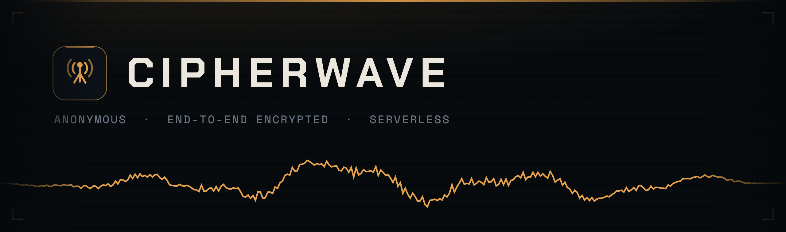
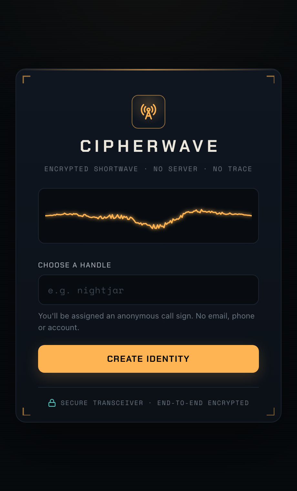
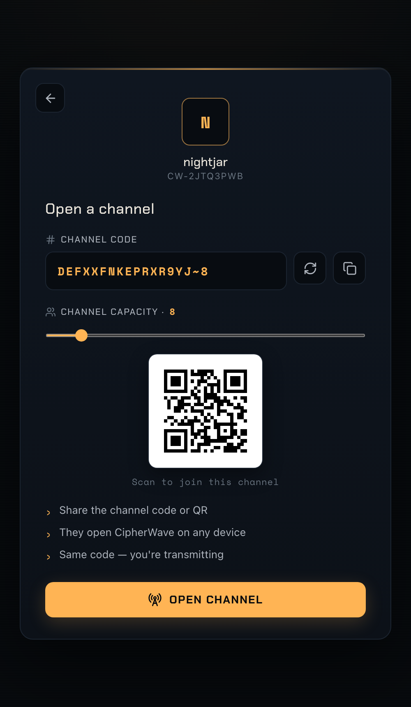
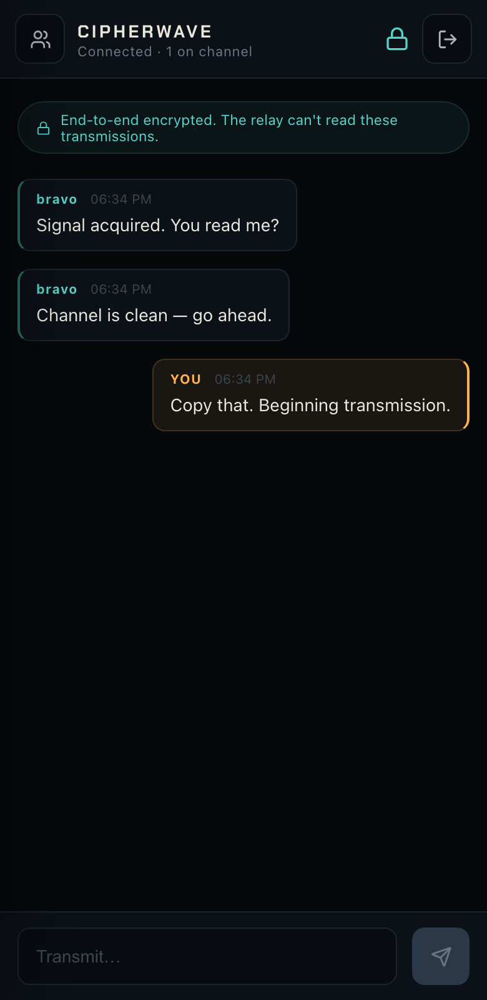
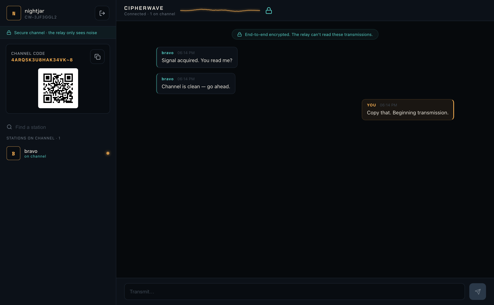

<p align="center">
  
</p>

<h1 align="center">CipherWave</h1>

<p align="center">
  <strong>Anonymous, end-to-end encrypted chat that runs from a single HTML file — no account, no server, no trace.</strong>
</p>

<p align="center">
  
  
  
  
  
</p>

---

CipherWave is a secure messenger with an unusual property: **the entire app is one self-contained `index.html`.** Double-click it, pick a handle, share a channel code, and you're talking — encrypted end to end, with **nothing of yours running anywhere**. No backend to deploy, no account to create, no database holding your messages.

It's dressed as a clandestine shortwave station because that's what it is underneath: anonymous call signs, channels you tune into, and transmissions that are pure noise to anyone in between.

<table>
  <tr>
    <td width="33%"></td>
    <td width="33%"></td>
    <td width="33%"></td>
  </tr>
</table>

<p align="center"></p>

## Why it's different

- **Truly serverless.** Peers find each other and relay messages through public MQTT brokers. You operate nothing — there's no signaling server, no TURN server, no database.
- **Opens from `file://`.** `npm run build` produces a single inlined `www/index.html` (fonts, styles and code all embedded). Host it anywhere, or just open the file. It's a secure context, so WebCrypto works the same as on `https`.
- **Relay-proof end-to-end encryption.** Everything that crosses the broker — messages, presence, even nicknames — is ciphertext. The broker only ever sees an opaque blob on a topic that is a hash of your channel code.
- **Anonymous by construction.** No email, phone, or account. You choose a handle and are assigned a random call sign (`CW-…`). Nothing is stored; history lives only in the open tab.
- **Group channels (2–64).** Set a capacity when you open a channel; it travels inside the shareable code.
- **Share by QR.** Every channel shows a QR code (and, when hosted, a one-tap join link).

## How the encryption works

Two independent layers protect every transmission:

1. **Transport layer (vs. the relay).** A key is derived from the channel code (`HKDF-SHA-256` → `AES-256-GCM`). *Every* payload published to the broker is encrypted with it. Because the broker never learns the channel code — only `SHA-256(code)`, used as the topic — it cannot read messages, presence, or nicknames. It sees noise.
2. **Pairwise layer (between members).** Each pair of peers performs an ephemeral **ECDH (P-256)** key agreement and derives its own `AES-256-GCM` key (HKDF, salted with the channel code). Every pair has a distinct key, and a party without the code cannot derive a working one even after observing the public keys.

> The channel code is the access secret — anyone who has it is a member, by design. Treat it like a password; generated codes carry ~80 bits of entropy. CipherWave does **not** provide forward secrecy or hide metadata such as timing and IP addresses. See the full **[threat model](docs/security/threat-model.md)**.

## How it connects

```
 your browser ──┐                            ┌── their browser
                │   public MQTT broker(s)     │
 encrypt (E2E) ─┤  topic = SHA-256(channel)  ├─ decrypt (E2E)
                │   sees only ciphertext      │
                └────────────────────────────┘
```

There is **no WebRTC** — direct peer-to-peer fails in too many real networks (NAT, captive portals, isolated browser contexts) and free TURN relays are unreliable. Instead, CipherWave relays the already-encrypted payloads through public pub/sub brokers (EMQX, HiveMQ, Mosquitto, with automatic failover). It's the model a self-hosted relay would give you — without the self-hosting.

## Quick start

**Just use it** — open the prebuilt file:

```bash
open www/index.html        # macOS  (or double-click it)
```

Open it in two windows (or on two devices), pick different handles, share the channel code, and transmit.

**Build it yourself:**

```bash
npm install
npm run build:client       # → www/index.html (one self-contained file)
```

**Develop with hot reload:**

```bash
npm run dev:client         # http://localhost:17612
```

## Using it

1. **Create an identity** — choose a handle; you're given an anonymous `CW-…` call sign.
2. **Open a channel** — generate a code (or paste one you were sent), set the capacity, and connect. Share the code or QR.
3. **Transmit** — once a station joins, the channel secures and the composer unlocks. Closing a tab cleanly leaves the channel (via an MQTT last-will), so others see you drop off.

## Tech stack

| Layer | Choice |
|---|---|
| UI | Svelte 5 + Vite 6, bundled to a single file with `vite-plugin-singlefile` |
| Transport | MQTT over WebSockets (`mqtt`) to public brokers |
| Crypto | Web Crypto API — ECDH P-256, HKDF-SHA-256, AES-256-GCM |
| Extras | `qrcode-generator`, Chakra Petch + Space Mono (inlined, offline) |

## Project structure

```
src/client/
  src/
    App.svelte          UI — identity / channel / transmission log
    lib/
      mesh.ts           MQTT pub/sub transport + relay-proof envelope encryption
      e2e.ts            ECDH + HKDF + AES-GCM primitives (pure, unit-tested)
      chat.ts           orchestration store — key exchange, per-recipient encryption
    components/Waveform.svelte   the live oscilloscope signature
docs/
  security/threat-model.md      what's protected and what isn't
tests/                          unit + Playwright e2e
```

> The repository also contains a legacy Node signaling server under `src/server/` from an earlier architecture. It still builds and is tested, but the app no longer needs it — chat is fully serverless.

## Tests

```bash
npm test           # unit + integration (crypto, key exchange, mesh orchestration)
npm run typecheck  # TypeScript
npx playwright test  # e2e — UI flows + boots the built file from file://
```

The suite proves the cryptography end to end: per-pair key isolation, channel-code key binding, that an outsider (or the relay) cannot decrypt, and that the built `file://` page mounts with WebCrypto available.

## License

[MIT](LICENSE)
